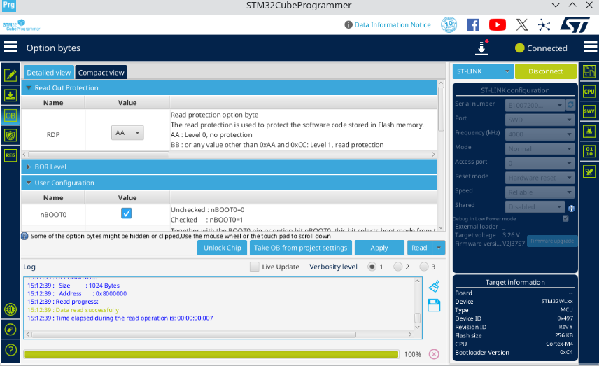
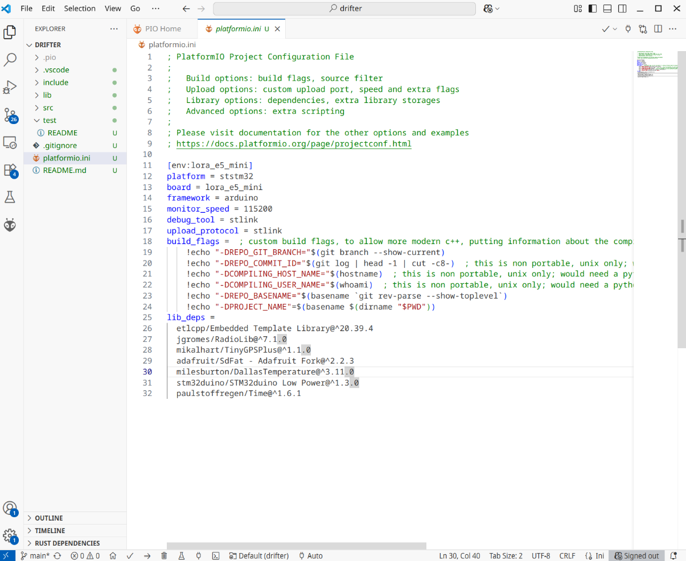
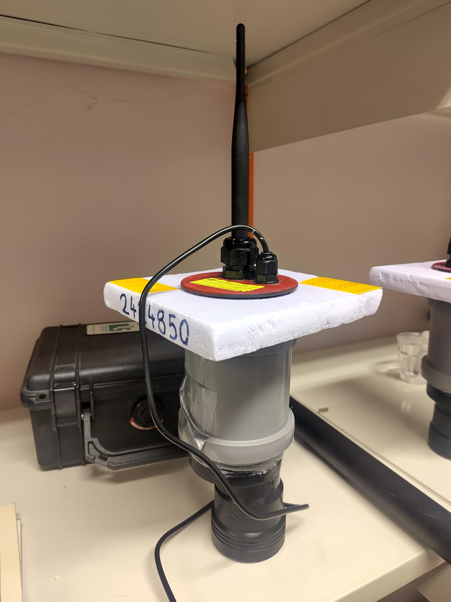

# The Open Lora Buoy (OLB)
This repository contains the firmware, list of hardware and PCB schematics that collectively make up the Open Lora Buoy (OLB), as described in our paper which you can read [here](https://arxiv.org/abs/2601.05615). The buoy is designed to be a low-cost, open-source drifter for coastal water measurements. The archive is currently incomplete, but more updates will come. 


## List of hardware components

### Drifter

A single OLB drifter's electronics is made up of the following components, with links to manufacturer website. 


| Quantity | Component | Note |
| -------- | --------- | ---- |
| 1 | [Seeed Studio Wio-E5 mini](https://wiki.seeedstudio.com/LoRa_E5_mini/) | Comes with actory protection which needs to be disabled manually |
| 1 | [Adafruit Ultimate GPS](https://www.adafruit.com/product/746)          | Comes with a holder for a CR1212 clock battery to remember last fix.| 
| 1 | [Adafruit SD Breakout](https://www.adafruit.com/product/254)           | |
| 1 | [DS18B20 temperature sensor](https://www.sparkfun.com/temperature-sensor-waterproof-ds18b20.html)
| 1 | [Pololu 3.3 V Step up/Step down voltage regulator](https://www.pololu.com/product/2122) | |
| 1 | [Saft LSH20](https://www.nkon.nl/novat/saft-lsh-20-lithium-battery-3-6v.html) | U solder tags recommended  |
| 1 | 10 kOhm resistor  |
| 1 | 4.7 kOhm resistor  |
| 2 | 33.0 Ohm resistors |
| 1 | Magnetic switch         |
| 1 | [XT30 connector](https://www.dfrobot.com/product-1762.html) | Not mandatory, but makes arming and disarming the drifter easier |

## Assembly instructions

### Electronics assembly
Order the [PCBs](https://github.com/larswd/OpenLoraBuoy/tree/main/hardware/buoy_PCB) by uploading the Gerber files folder to your favourite PCB manufacturer, such as [JLCPCB](https://cart.jlcpcb.com/quote?spm=jlcpcb.Public.2006) or [Seeed studio](https://www.seeedstudio.com/fusion_pcb.html). Then order the components listed above according to how many buoys you plan to make. They can be ordered either from the manufacturer, and in many cases from a local electronics dsitributor. 

The assembly can begin once you have all the components at hand. The PCBs offered are currently Through-Hole PCBs, and requires therefore manual soldering. As both sides of the PCB is utilized in somewhat overlapping segments, it is vital that some components are soldered before others. I would recommend soldering in this order: 

1. Wires to the power pins at the bottom of the PCB
2. Pololu
3. Trim the pins on the back of the Pololu, then tape. 
4. SD card writer
5. Trim the pins on the back of the SD card writer, then tape.
6. GPS
7. Trim GPS pins
8. Wio E5 mini
9. MF pin sockets for the programmable pins
10. DS18B20
11. Resistors
12. Magnetic switch
13. Battery connectors
    


### Installation instructions
The installation of the OLB firmware is a two-step process. First, you need to remove the write protection that the WiO-E5-mini comes with out of the box. To do so, you first need a USB C cable and a [ST-Link](https://www.adafruit.com/product/2548). Then, download the [STM32CubeProgrammer](https://www.st.com/en/development-tools/stm32cubeprog.html#get-software), and install it. Once it is installed, connect the Wio-E5 mini to your laptop via both the USB C cable and with the ST-link. Here, you need to connect the right pins, and we list them as (ST Link pin/Wio pin), 
- (RST/RST),
- (SWCLK/CLK),
- (SWDIO/DIO),
- (GND/GND).
Afterwards, set ```shared``` to ```Enabled``` and ```Reset mode``` to ```Hardware reset```. If you press the circular arrows button, then if everything works you should see under the **OB** header an option called **Read out protection**, set this drop-down menu to AA and press **Apply**. The buoy is now programmable! See a helpful visual guide below: 



The next step is to upload the firmware. If you are happy with the default configuration, then you can jump to the next paragraph. Otherwise, you can configure most important parameters in the [configuration file](firmware/drifter/src/config.h). What each parameter does is described in the [drifter README file](firmware/drifter/README.md).

Once you have a configuration file you are satisifed with, you can upload the firmware to the buoy. To do so, we use [PlatformIO IDE for vscode](https://docs.platformio.org/en/latest/integration/ide/vscode.html), an extension for visual studio code made for programming microcontrollers. Once you have installed platformIO, click **Open project** under the **PIO Home** tab, and navigate to the *firmware/drifter* folder and click **Open drifter**. From here, platformio will open and read the necessary configurations. Once the project has loaded finished loading, which you can see when several new buttons have appeared at the bottom task bar in visual studio code, then you can upload the code. An image of a fully loaded platformio instance is shown below, in particular note the checkmark and arrow key at the very bottom. 


To upload the code, connect the OLB to your computer both with the ST link (connection instructions are given above) and the USB C cable, then press the upload button (The arrow icon), then wait until the terminal that popped up states something close to 
```
============================================= [SUCCESS] Took 3.12 seconds =============================================
```
### Final assembly 

The container components we used are given in the table below 

| Component | Role |
| --------- | ---- |
| [Pipe connector](https://www.biltema.no/bygg/vvs/sanitet-og-vann/avlop/innendors-avlop-gra/innendors-avlop-gra-75-mm/avlopsror-skjotemuffe-75-mm-2000059003) | Main electrical component housing |
| [Lid 75 mm](https://www.biltema.no/bygg/vvs/sanitet-og-vann/avlop/innendors-avlop-gra/innendors-avlop-gra-75-mm/avlopsror-endestopp-75-mm-2000059011) | Top lid |
| [Reduction 75->50mm](https://www.biltema.no/bygg/vvs/sanitet-og-vann/avlop/innendors-avlop-gra/innendors-avlop-gra-75-mm/avlopsror-reduksjon-o-7550-mm-2000065100) | Ballast and battery container |
|[Lid 50 mm](https://www.biltema.no/bygg/vvs/sanitet-og-vann/avlop/innendors-avlop-gra/innendors-avlop-gra-50-mm/avlopsror-endestopp-o-50-mm-2000065102) | Bottom lid |
| [Large cable gland](https://no.rs-online.com/web/p/cable-glands/6694673) | Cable gland for the antenna |
| [Small cable gland](https://no.rs-online.com/web/p/cable-glands/6694660) | Cable gland for DS18B20 |
| [Ballast](https://www.frederiksen-scientific.no/produkt/lodd-med-krok-200-g/191002) | We use 300 grams of tin ballast in each OLB drifter |
| [XPS 300](https://thaugland.no/butikk/byggevarer/isolasjon/mark-grunn-isolasjon/xps/jackon-isolasjon-xps-20mm-300-jackofoam/) | 20 mm isolation foam as a floation device around the top for increased stability. |

 
To assemble, drill two holes in the top lid for the two cable glands. Thereafter, sand the lid to ensure that the top is as uniform as possible. Apply generously with grease on each of the rubber bands on the cable glands and inside the pipes. Insert the fully assembled OLB electronics through the cable glands in the lid. Tighten the antenna gland, but not the thermistor gland, and watch carefully to ensure that the tightening does not loosen the antenna connection to the main circuit board. Insert the bottom lid into the reduction, then place the ballast in the bottom 50 mm diameter pipe, use silicone or other lipophile glue to ensure that it stays put, and add a small cardboard or plastic disc at the top to ensurean even surface. Mark where the magnetic switch is supposed to be placed on the pipe connector with permanent marker, then tape the switch on the other side underneath the marker. Be careful, as improper switch placement means that it is difficult to check if the buoy is turned off while inactive. Cut out a small square or disk of the XPS 300, approximately 15 cm wide at the widest, and cut a 75 mm diameter hole in the middle. Insert the lid into the XPS 300, and then into the pipe connector. Connect the battery to the electronics, and validate that the switch works as intended. Finally, insert the reduction into the connector, and seal the buoy by tightening the thermistor cable gland. 



Your OLB drifter is now ready to use. 

## Images and deployments
Images from the deployments will come soon. 

## A small thanks 
We would also like to thank the authors of the many open source libraries that collectively form the code base of the Open Lora Buoy. In no particular order, we wish to express our gratitude to 
- [Paul Stoffregen and contributors' OneWire](https://github.com/PaulStoffregen/OneWire)
- [Mikal Hart and contributors' TinyGPSplus](https://github.com/mikalhart/TinyGPSPlus)
- [Jan Gromeš and contributors's Radiolib](https://github.com/jgromes/RadioLib)
- [Bill Greiman's SdFat](https://github.com/greiman/SdFat)
- [Jean Rabault's OpenMetBuoy](https://github.com/jerabaul29/OpenMetBuoy-v2021a)
